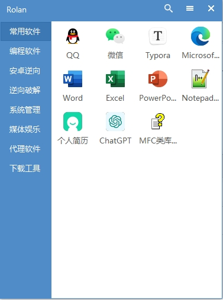

# WTools(Windows工具箱)

> 分卷压缩工具的使用

## `compress.list`文件

此文件为`compress`命令要压缩的指定文件配置文件，他是一个文本文件。

```html
software/Android Reverse/jadx/lib/jadx-gui-1.5.1-all.jar
software/Common Software/zyplayer/zyfun.exe
software/Common Software/zyplayer/resources/app.asar
software/Download Tools/HitomiDownloader/HitomiDownloader.exe
software/Proxy Software/Clash.for.Windows/Clash for Windows.exe
software/Proxy Software/mihomo-party/Mihomo Party.exe
```

## 下载

下载或者克隆`git`仓库后，使用 `compress un7z`解压分卷压缩的原文件，解压后会删除分卷压缩文件。

## 上传

需要提交`git`仓库，使用`compress 7z`命令把大文件分卷压缩，默认压缩大小是`50m`，如果要修改分卷大小，可使用`compress 7z 10m`来指定分卷大小，现在为`10m`大小。

## 删除

使用`compress delete`删除所有分卷压缩文件。

## 预览


